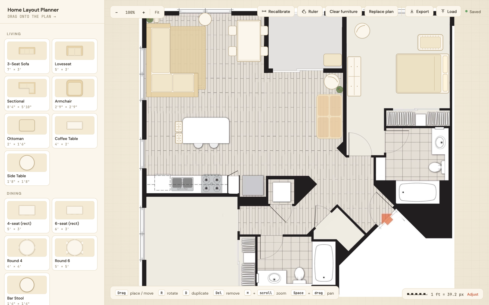
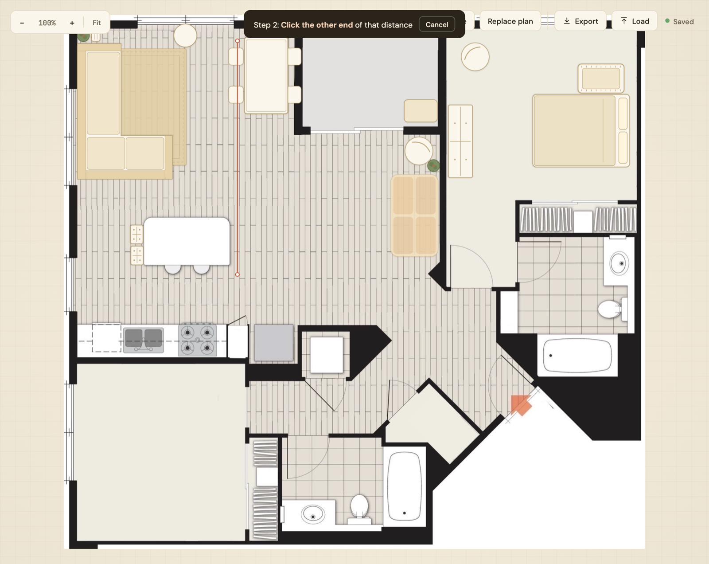
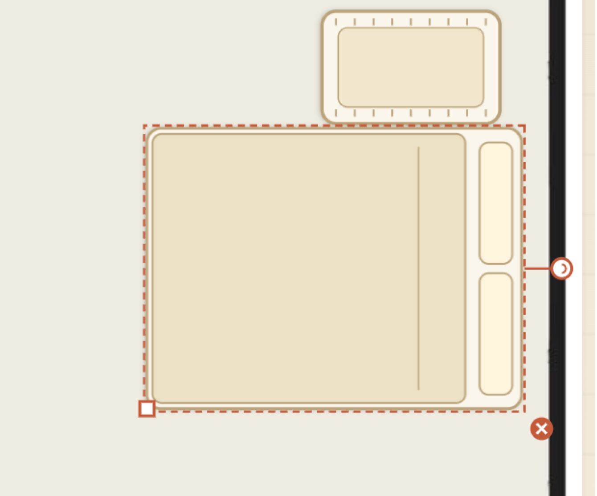
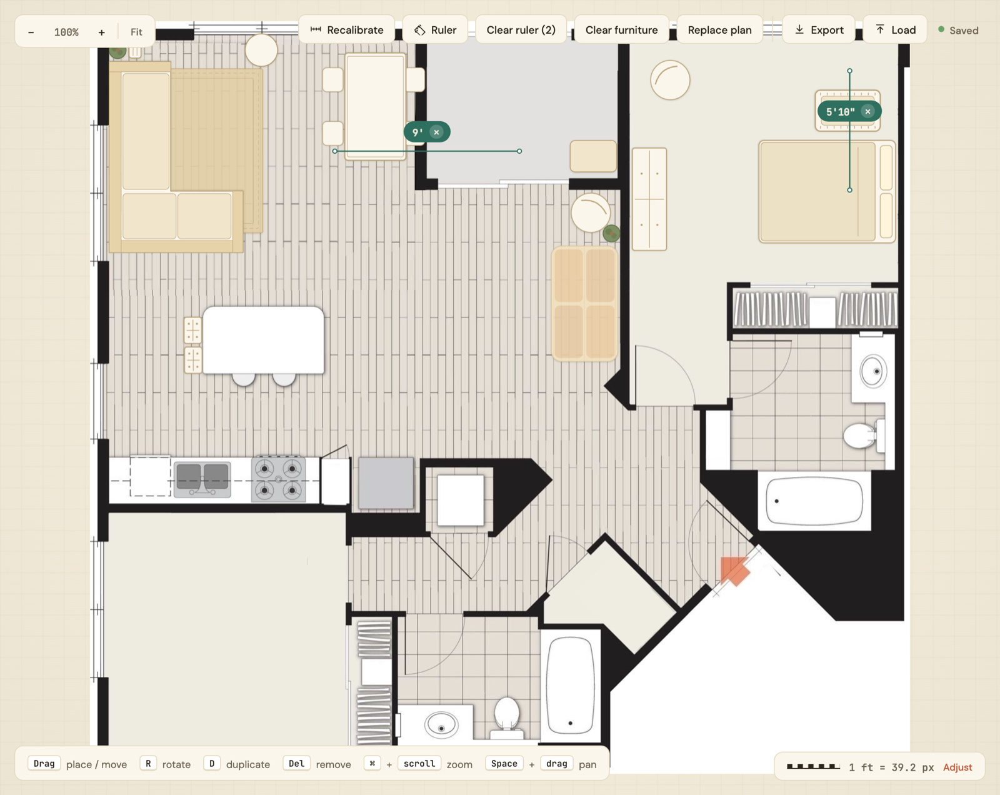

# 🛋️ FloorIt

### Home Layout Planner

**Drop in a floor plan, set the scale, and arrange real-world-sized furniture, right in your browser.**

No build step · No dependencies to install · No backend




## ✨ What it does

FloorIt turns any floor-plan image (a screenshot, a listing photo, a hand-drawn sketch) into an
interactive planner. Calibrate the scale once by clicking a known distance, then drag furniture
drawn to **true real-world dimensions** onto the plan. Everything snaps, rotates, resizes, and
measures in real feet and inches, so you can answer "will the sectional actually fit?" before you
move a thing.

## 🎯 Features

| | |
|---|---|
| 📐 **Real-world calibration** | Click two ends of a known distance, type the length, and every piece is instantly scaled to match your plan. |
| 🪑 **46-piece furniture catalog** | Beds, sofas, sectionals, dining sets, desks, storage, rugs, plants & more, across **9 categories**, each with accurate dimensions. |
| 🖱️ **Drag, drop & arrange** | Pull pieces straight from the sidebar onto the canvas. Move, **rotate**, **resize**, **duplicate**, and delete with on-canvas handles. |
| 📏 **Ruler tool** | Measure any distance on the plan in feet & inches. Drop as many measurements as you like; hold `Shift` to lock to an axis. |
| 🔍 **Zoom & pan** | Pinch / `⌘`+scroll to zoom, `Space`+drag to pan around large plans. |
| 💾 **Autosave + Export/Import** | Your layout auto-saves to the browser. Export the whole plan (image + furniture + scale) to a portable `.json` and load it anywhere. |
| 🎨 **Warm, tactile UI** | Soft top-down furniture art and a homey palette. It actually feels nice to plan in. |


## 📸 Screenshots

### Set the scale by clicking a known distance

Drop two points along anything you know the length of (a wall, a door, a tile run) and FloorIt
calibrates pixels-to-inches for the whole plan.



### Place & shape furniture

Select any piece to reveal **rotate**, **resize**, and **delete** handles. Sizes update live in
real-world feet & inches as you drag.



### Measure anything

The built-in **ruler** lays down distance markers anywhere on the plan, perfect for checking
walkways, clearances, and "does the couch leave room to walk?"




## 🚀 Getting started

There's nothing to install. Pick either option:

```bash
# Option A: just open it
open index.html

# Option B: serve the folder (recommended; avoids file:// quirks)
python3 -m http.server 8000
# then visit http://localhost:8000
```

Then:

1. **Upload** a floor-plan image (PNG · JPG · WEBP · SVG). Drag it in or click to browse.
2. **Set the scale** by clicking one end of a known distance, clicking the other, then typing the real length.
3. **Drag furniture** from the sidebar onto your plan and arrange away.
4. **Export** to `.json` when you want to save or share your layout.

> React 18, ReactDOM, and Babel are loaded from a CDN and compile the inline JSX at runtime, so the
> first load needs an internet connection.


## 🧠 How it works

FloorIt juggles three coordinate spaces, and `pxPerInch` is the bridge between them:

- **Image-pixel space**: the SVG `viewBox` matches the uploaded image's natural pixel size. Placed
  positions and calibration points live here.
- **Screen-pixel space**: actual rendered pixels, used for hit-testing and the floating tags.
- **Real-world inches**: every catalog item's `w`/`h`. Calibration replaces the initial width-based
  guess so furniture is drawn at true scale.

Furniture is rendered as lightweight top-down SVG, each shape drawn in its own inch-space coordinate
system and dispatched by `kind`.

## 📄 License

[MIT](LICENSE) — use it, fork it, ship it.
